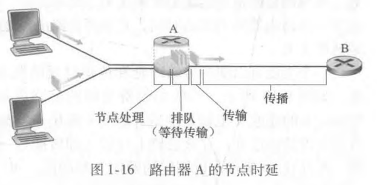
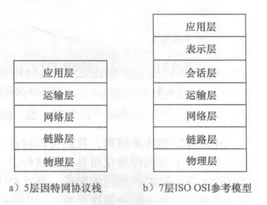
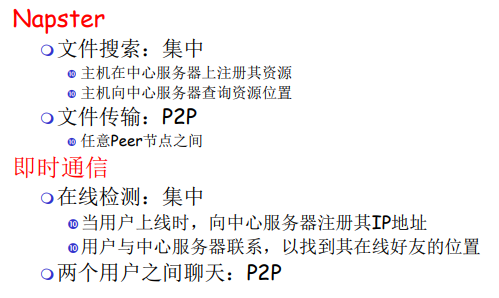
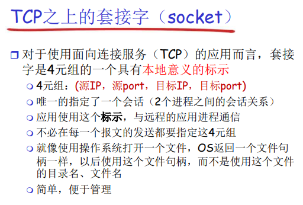
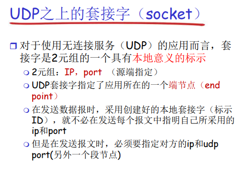
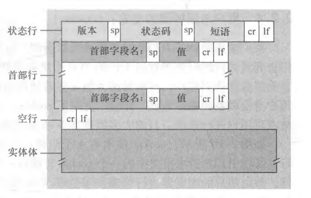
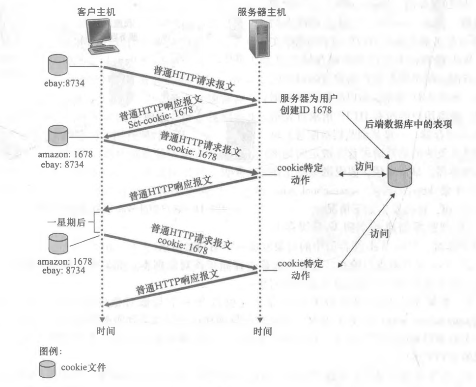
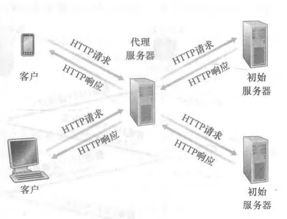
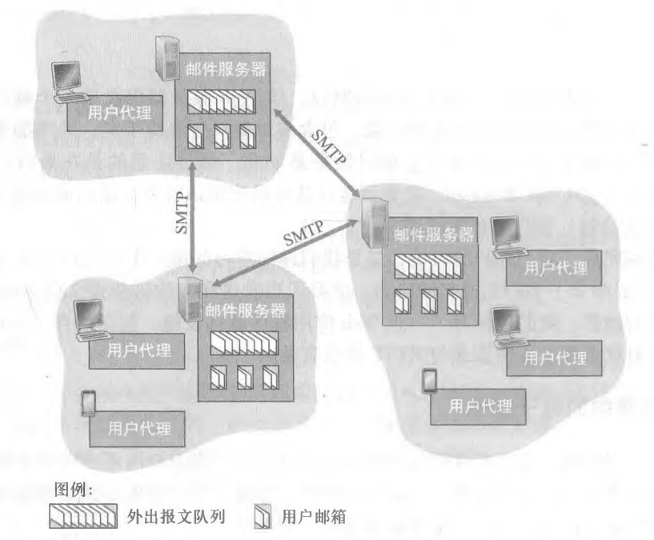

# 1. 计算机网络和因特网

## 1.1 什么是因特网

### 1.1.1 具体构成描述

### 1.1.2 服务描述

### 1.1.3 什么是协议

## 1.2 网络边缘

### 1.2.1 接入网

1. 指将端系统物理连接到其边缘路由器（edge router）的网络。边缘路由器是端系统到任何其他远程端系统的路径上的**第一台路由器**。

### 1.2.2 物理媒体

1. 物理媒体分成两种类型：**导引型媒体**(guided media)和**非导引型媒体**(unguided media) 。对于导引型媒体, 电波沿着固体媒体前行，如光缆、双绞铜线或同轴电缆。对于非导引型媒体，电波在空气或外层空间中传播，例如在无线局域网或数字卫星频道中。

## 1.3 网络核心

1. 即由互联因特网端系统的**分组交换机**和**链路**构成的网状网络。

### 1.3.1 分组交换

1. 为了从源端系统向目的端系统发送一个报文，源将长报文划分为较小的数据块，称之为**分组**（packet）。  
2. 在源和目的地之间，每个分组都通过通信链路和**分组交换机**（packet switch ）传送。（交换机主要有两类：**路由器**（router）和**链路层交换机**（link-layer* switch）。
3. 分组以等于该链路最大传输速率的速度传输通过通信链路。
4. 存储转发传输  
   多数分组交换机在链路的输入端使用存储转发传输（store-and-forward transmission）机制。
5. 排队时延和分组丢失
6. **转发表**和**路由选择协议**
   每台路由器具有一个转发表(forwarding table),用于将目的地址(或目的地址的一部分)映射成为输岀链路。

### 1.3.2 电路交换

### 1.3.3 网络的网络

## 1.4 分组交换网中的时延、丢包和吞吐量

### 1.4.1 分组交换网中的时延概述

1. **节点处理时延**(nodal processing delay)
2. **排队时延**(queuing delay)
3. **传输时延**(transmission delay)
4. **传播时延**(propagation delay)  
这些时延总体累加起来是节点总时延(tolal nodal delay)。  
  

### 1.4.2 排队时延和丢包

1. 当数据包在网络设备（如路由器、交换机）的队列中等待被处理时，会引起**排队时延**。
2. 数据包在传输过程中有时可能会丢失，这称为**丢包**。丢包可能由多种原因引起，例如网络拥塞、设备故障或信号干扰等。

### 1.4.3 端到端时延

### 1.4.4 计算机网络中的吞吐量

1. **吞吐量（Throughput）**  
   是指在单位时间内成功传输的数据量或信息量，通常以比特（bits）或字节（bytes）为单位。吞吐量是衡量网络性能和数据传输能力的重要指标之一，它反映了网络在一段时间内实际传输数据的速度。
2. 计算方法  
     

## 1.5 协议层次及其服务模型

### 1.5.1 分层的体系结构

### 1.5.2 封装（Encapsulation）

1. 指将数据包装在不同层次的协议头（Header）和协议尾（Footer）中，以便在网络中传输和处理。封装是实现通信协议的基本机制之一，它允许不同层次的网络协议在数据传输过程中进行有效的协同工作。

## 1.6 面对攻击的网络

## 1.7 计算机网络和因特网的历史

# 2. 应用层

## 2.1 应用层协议原理

### 2.1.1 网络应用程序体系结构

1. **应用程序体系结构**：
   * 客户-服务器体系结构  
      > 1.服务器：  
      >
      > * 一直运行
      > * 固定的IP地址和周知的端口号  
      > * 扩展性：数据中心
      >  
      > 2.客户端：
      >
      > * 主动与服务器通信
      > * 与互联网有间歇性的连接
      > * 可能是动态IP
      > * 不直接与其他客户端通信

   * 对等体系结构（P2P）  
      > 1.（几乎）没有一直运行的服务器  
      > 2. 任意端系统之间可以进行通信  
      > 3. 每一个节点既是客户端又是服务器（自开展性）  
      > 4. 常与的主机间歇性连接且可以改变IP地址（难以管理）  
   * 混合体：客户-服务器和对等体系结构  
      

### 2.1.2 进程通信

1. 用操作系统的术语来说，进行通信的实际上是**进程**（process）。  
2. 在用一个主机内，使用**进程间通信机制**通信（操作系统定义）。  
3. 在两个不同端系统上的进程，通过跨越计算机网络交换**报文**（message）而相互通信。  
4. **客户和服务器进程**
   * 通常将这两个进程之一标识为**客户**(client)(发起通信)，另一个进程标识为**服务器**(server)(等待联系)。
5. **进程与计算机网络之间的接口 -- 套接字（API）**  
   进程通过一个称为套接字（sockel）的软件接口向网络发送报文和从网络接收报文。是同一台主机内应用层与运输层之间的接口。因此套接字也称为应用程序和网络之间的应用程序编程接口（Application Programming Interface, API）。  
     
     

6. **进程寻址**  
   在一台主机上运行的进程为了向在另一台主机上运行的进程发送分组，接收进程需要有一个地址。为了标识该接收进程，需要定义两种信息：① 主机的地址；② 在目的主机中指定接收进程的标识符。
   * **IP(IP address)**  
      IP地址是一个32比特的量且能唯一地标识主机。  
   * **端口号**  
      使发送的进程知道指定运行在接收主机上的接收进程。
      例如，Web服务器用端口号80来标识。邮件服务器进程(使用SMTP协议)用端口号25来标识。

### 2.1.3 可供应用程序使用的运输服务

1. 大体能从四个方面对应用程序服务要求进行分类：  

   * **可靠数据传输**
   * **吞吐量**  
   * **定时**
   * **安全性**

### 2.1.4 因特网提供的运输服务

因特网（更一般的是TCP/IP网络）为应用程序提供两个运输层协议，即UDP和TCP。

1. **TCP服务**  
   包括**面向连接服务**和**可靠数据传输服务**。  

2. **UDP服务**  
   UDP是一种不提供不必要服务的轻量级运输协议，它仅提供最小服务。UDP是**无连接的**，因此在两个进程通信前没有握手过程。  

3. **因特网运输协议所不提供的服务**
   * **运输协议服务**  
      可靠数据传输、吞吐量、定时和安全性
   * **不提供的服务**  
      **吞吐量**和**定时保证**。

### 2.1.5 应用层协议

1. 应用层协议（application-layer protocol）定义了运行在不同端系统上的应用程序进程如何相互传递报文。  

   > 1. 交换的报文类型，例如请求报文和响应报文。  
   > 2. 各种报文类型的语法，如报文中的各个字段及这些字段是如何描述的。  
   > 3. 字段的语义，即这些字段中的信息的含义。  
   > 4. 确定一个进程何时以及如何发送报文，对报文进行响应的规则。

2. 由RFC文档定义。
3. 有公有和私有协议。

## 2.2 Web和HTTP

### 2.2.1 HTTP概况

1. **超文本传输协议（HyperText Transfer Protocol, HTTP）**  
   * 是Web的应用层协议。  
   * 定义了报文的结构以及客户和服务器进行报文交换的方式。  
   * 定义了Web客户向Web服务器请求Web页面的方式，以及服务器向客户传送Web页面的方式。

### 2.2.2 非持续连接和持续连接

1. **非持续连接**  
   每个请求/响应对是经一个单独的TCP连接发送。
2. **持续连接**  
   所有的请求及其响应经相同的TCP连接发送。
3. **往返时间（Round Trip Time, RTF）**  
   该时间是指一个短分组从客户到服务器然后再返回客户所花费的时间。RTT包括分组传播时延、分组在中间路由器和交换机上的排队时延以及分组处理时延。
     
   三次握手中前两个部分所耗费的时间占用了一个RTT。  
   客户结合三次握手的第三部分（确认）向该TCP连接发送一个HTTP请求报文。

### 2.2.3 HTTP报文格式

1. **HTTP请求报文**  
     
   一个请求报文能够具有**更多的行**或者**至少为一行**。  

   * 第一行：**请求行**  

      > 1. 三个字段：
      >     * 方法字段(GET、POST、HEAD、PUT和DELETE)
      >     * URL字段
      >     * HTTP版本字段。  

   * 后续行：**首部行**  

      > 1. Host: 指明了对象所在的主机。
      > 2. Connection: 要求服务器在发送完被请求的对象后就关闭这条连接。
      > 3. User-agent: 来指明用户代理，即向服务器发送请求的浏览器的类型。  
      > 4. Accept-language: 表示用户想得到该对象的法语版本。否则为默认版本。

   * 请求报文的通用格式  
        
      * **实体行**  
         使用GET方法时实体体为空，而使用POST方法时才使用该实体体。  
         如果方法字段的值为POST时，则实体体中包含的就是用户在表单字段中的输入值。

2. **HTTP响应报文**  

     
   * 状态行  
  
      > 1. 三个字段：
      >     * 协议版本字段
      >     * 状态码
      >     * 相应状态信息

   * 首部行

      > 1. Connection：发送完报文后的关闭TCP连接。
      > 2. Date：首部行指示服务器产生并发送该响应报文的日期和时间。服务器从它的文件系统中检索到该对象，将该对象插入响应报文，并发送该响应报文的时间。
      > 3. Server: 指示该报文是由一台Apache Web服务器产生的。
      > 4. Laat-Modified: 指示了对象创建或者最后修改的日期和时间。
      > 5. Content-Length: 指示了被发送对象中的字节数。
      > 6. Content-Type: 指示了实体体中的对象是HTML文本。

   * 实体行  
      报文的主要部分，既它包含了所请求的对象本身（表示为data data data ...）。

   * 响应报文的通用格式  
        
      常见的状态码和相关的短语  

      >  1. 1xx - 信息性状态码（Informational）
      >     * 100 Continue: 继续
      >     * 101 Switching Protocols: 切换协议
      >  2. 2xx - 成功状态码（Successful）
      >     * 200 OK: 请求成功
      >     * 201 Created: 已创建
      >     * 202 Accepted: 已接受
      >     * 204 No Content: 无内容
      >  3. 3xx - 重定向状态码（Redirection）
      >     * 300 Multiple Choices: 多种选择
      >     * 301 Moved Permanently: 永久移动
      >     * 302 Found: 临时移动
      >     * 304 Not Modified: 未修改
      >  4. 4xx - 客户端错误状态码（Client Errors）
      >     * 400 Bad Request: 错误的请求
      >     * 401 Unauthorized: 未授权
      >     * 403 Forbidden: 禁止访问
      >     * 404 Not Found: 未找到资源
      >     * 405 Method Not Allowed: 方法不允许
      >     * 406 Not Acceptable: 不可接受
      >     * 429 Too Many Requests: 请求过多
      >  5. 5xx - 服务器错误状态码（Server Errors）
      >     * 500 Internal Server Error: 服务器内部错误
      >     * 501 Not Implemented: 未实现
      >     * 502 Bad Gateway: 错误的网关
      >     * 503 Service Unavailable: 服务不可用
      >     * 504 Gateway Timeout: 网关超时

### 2.2.4 用户与服务器的交互：cookie

1. 使内容和用户身份联系，如：

   * 会话状态管理：
      如用户登录状态、购物车、游戏分数或其他需要记录的信息
   * 个性化设置：
      如用户自定义设置、主题和其他设置
   * 浏览器行为跟踪：
      如跟踪分析用户行为等

  

### 2.2.5 Web缓存

1. Web缓存器（Web cache）也叫**代理服务器**（proxy server）,它是能够代表初始Web服务器来满足HTTP请求的网络实体。  
2. Web缓存器既是服务器又是客户。当它接收浏览器的请求并发回响应时，它是一个服务器。当它向初始服务器发出请求并接收响应时，它是一个客户。  

  
Web缓存器可以大大减少对客户请求的响应时间。  

### 2.2.6 条件GET方法

条件GET是一种在HTTP中用于**优化网络传输**和**减少带宽使用**的机制。它允许客户端（通常是浏览器）在请求资源时，只在资源发生变化时才下载该资源，从而减少不必要的数据传输和提高性能。减少由于高速缓存存放在缓存器中的对象副本可能是陈旧的。  

1. **条件GET工作原理**：
   客户端发送一个GET请求，但同时指定了一个时间戳（通过 "If-Modified-Since" 首部行），服务器根据这个时间戳来判断资源是否已经更新。  
2. **IF-Modified-Since**：  
   服务器之前存储的响应报文中的Last-Modified。

## 2.3 因特网中的电子邮件  

1. 主要组成部分：
   * **用户代理**
   * **邮件服务器**
   * **简单邮件传输协议**

### 2.3.1 SMTP

SMTP是因特网电子邮件的核心。SMTP用于从发送方的邮件服务器发送报文到接收方的邮件服务器。SMTP一般不使用中间邮件服务器发送邮件。  

1. 基本原理
   * **连接建立**： 发件人的电子邮件客户端或服务器与发件人的 SMTP 服务器建立连接(25号端口)。
   * **身份验证**： 在某些情况下，发件人需要提供身份验证，以确保合法的发送。
   * **发送命令**： 发件人将邮件的各种信息（如收件人地址、邮件内容等）发送给 SMTP 服务器。
   * **转发**： 发件人的 SMTP 服务器将邮件转发到接收者的 SMTP 服务器。
   * **接收**： 接收者的电子邮件客户端或服务器从接收者的 SMTP 服务器中接收邮件。  

### 2.3.2 与HTTP的对比
